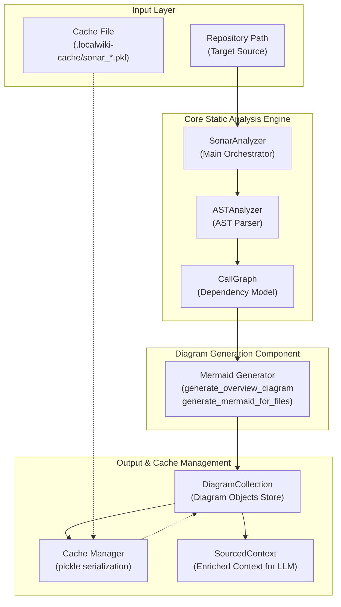

---
I have launched a command to locate `sonar_analyzer.py` on the system. I will wait for the search result.
# Sonar Analyzer Technical Wiki

## Introduction
`SonarAnalyzer`는 LocalWiki 정적 분석(static analysis)의 핵심 엔트리 포인트(main entry point)로, 레포지토리 내 소스 코드의 AST(Abstract Syntax Tree) 구문 분석, 호출 그래프(CallGraph) 모델링, 그리고 이를 시각화하기 위한 Mermaid 다이어그램 생성 과정을 조율(orchestrate)하는 모듈입니다.

이 모듈은 대규모 코드베이스에 대해 매번 정적 분석을 새로 수행하지 않도록 파일 해시 기반의 캐싱 메커니즘을 지원하며, WikiPageGenerator 등과 협력하여 LLM 프롬프트에 풍부한 코드 아키텍처 및 AST 요약 정보를 제공합니다.

소스 코드 파일: [sonar_analyzer.py](file:///Users/jcjeong/lab/code-sonar/local-deepwiki/cli/sonar/sonar_analyzer.py)

---

## Overview & Architecture

`SonarAnalyzer`가 원본 코드에서 정보를 추출하고 다이어그램을 생성하여 캐싱하고 최종적으로 프롬프트 컨텍스트를 빌드하는 라이프사이클의 흐름을 나타낸 아키텍처 다이어그램입니다.



---

## Key Components & Classes

[sonar_analyzer.py](file:///Users/jcjeong/lab/code-sonar/local-deepwiki/cli/sonar/sonar_analyzer.py) 파일은 정적 분석 및 Mermaid 다이어그램 메타데이터 관리를 위해 다음과 같은 핵심 데이터 구조와 클래스를 정의하고 있습니다.

### 1. `Diagram` (dataclass)
생성된 단일 Mermaid 다이어그램과 이에 관련된 메타데이터를 저장하는 모델 객체입니다.
* **`title` (str)**: 다이어그램의 식별 가능한 제목 (예: "Architecture Overview", 디렉토리명).
* **`mermaid` (str)**: 백틱(```)으로 감싸진 마크다운 형식의 실제 Mermaid 다이어그램 문자열.
* **`related_files` (list[str])**: 해당 다이어그램의 생성 및 시각화에 관계된 소스 파일 경로들의 목록.
* **`topic_keywords` (list[str])**: 관련 위키 페이지에서 다이어그램을 검색할 때 인덱싱 기준으로 사용되는 토픽 키워드 목록.

### 2. `DiagramCollection` (dataclass)
분석 대상 레포지토리 전반에서 추출되고 빌드된 모든 `Diagram` 객체들과 `CallGraph` 인스턴스를 하나로 묶어 관리하는 컨테이너 클래스입니다.
* **`repo_path` (str)**: 레포지토리의 절대 경로.
* **`diagrams` (list[Diagram])**: 수집된 전체 다이어그램 목록.
* **`graph` (Optional[CallGraph])**: 분석 결과 구축된 호출 그래프 인스턴스.
* **`find_for_topic(topic: str) -> list[Diagram]`**: 
  - 주어진 주제 키워드(topic)를 단어 단위로 파싱한 후, `Diagram.topic_keywords`와의 연관도 점수를 측정 및 정렬하여 관련도가 가장 높은 다이어그램 목록을 반환합니다.
* **`find_for_files(file_paths: list[str]) -> list[Diagram]`**:
  - 지정한 파일 경로들을 소유하고 있거나 연관된 다이어그램을 탐색하여 반환합니다.
* **`overview` (property)**:
  - 전체 시스템의 구조를 개괄하는 "overview" 또는 "architecture" 다이어그램을 우선적으로 탐색하여 리턴합니다.

### 3. `SonarAnalyzer` (class)
정적 분석 파이프라인의 메인 조정기(Coordinator) 역할을 담당합니다.
* **`_CACHE_DIR`**: 캐시 데이터가 임시 보관되는 디렉토리명인 `".localwiki-cache"`가 상수로 지정되어 있습니다.
* **`__init__(repo_path: str, max_files: int = 300)`**:
  - 분석할 레포지토리 경로를 확인하고, `ASTAnalyzer` 객체를 인스턴스화합니다. 성능 및 과부하 제어를 위해 분석 대상 최대 파일 개수(`max_files`)를 기본 300개로 제한합니다.

---

## Core Workflows

### 1. Full Analysis Workflow (`analyze`)
```python
def analyze(self, use_cache: bool = True) -> DiagramCollection:
```
이 메서드는 전체 소스 코드를 대상으로 정적 분석을 시행하여 다이어그램 컬렉션을 생산합니다.
1. **Cache Loading**: `use_cache=True` 옵션이 켜져 있는 경우, 레포지토리 경로의 MD5 해시 값으로 명명된 피클 파일(`.localwiki-cache/sonar_{repo_hash}.pkl`)에서 캐시 데이터를 역직렬화(deserialization)하여 기분석된 결과를 즉시 반환합니다.
2. **AST Analysis**: 캐시가 무효화되었거나 존재하지 않는다면, `ASTAnalyzer.analyze_repo()`를 가동하여 소스 파일 내 클래스, 함수, 의존성 관계를 파싱하고 `CallGraph`를 형성합니다.
3. **Overview Generation**: 호출 그래프에서 최상위 중요 노드들을 중심으로 한 `Architecture Overview` 다이어그램을 생성하여 추가합니다.
4. **Per-cluster (Directory) Generation**: `CallGraph.cluster_by_file()` 및 `_group_by_directory()`를 이용하여 개별 파일 노드들을 루트 폴더 또는 하위 패키지 디렉토리 구조별로 그룹화합니다. 파일이 최소 2개 이상 포함된 개별 디렉토리에 대해 각각 세부 흐름도가 포함된 Mermaid 다이어그램을 생성합니다.
5. **Cache Persist**: 완성된 `DiagramCollection` 객체를 캐시 파일에 저장합니다.

### 2. Context Enrichment for Wiki Pages (`get_context_for_page`)
```python
def get_context_for_page(
    self,
    page_title: str,
    file_paths: list[str],
    collection: DiagramCollection | None = None,
) -> SourcedContext:
```
위키 문서 작성 모듈(`WikiPageGenerator`)이 LLM 질의 시 더 정확한 소스 코드 구조를 파악할 수 있도록 도우며, 정적 분석 메타데이터를 하나의 컨텍스트 텍스트 파일로 압축 전달하는 역할을 수행합니다.
1. **AST Summary Extraction**: 입력받은 파일 목록 중 상위 최대 10개 파일에 대해 AST 분석을 동적으로 다시 실행하여 파일별 구조 정보를 요약 문자열로 추출합니다.
   * 요약 정보 구성: 프로그래밍 언어(Language), 정의된 클래스 목록(최대 8개), 함수명 목록(최대 8개), 외부 import 모듈(최대 5개).
2. **Relevant Diagram Search**: 주어진 `page_title`을 인덱싱 키워드로 삼아 주제에 부합하는 다이어그램을 먼저 조회합니다. 매칭 결과가 없을 시 파일 경로를 참조하여 다이어그램을 찾으며, 이조차 불가능할 경우 `overview` 다이어그램을 선택하여 최대 2개까지 본문 컨텍스트에 삽입합니다.
3. **SourcedContext Mapping**: 추출된 텍스트와 다이어그램들을 결합하고, 해당 정보의 신뢰도 수준을 산출(context score: AST 요약 존재 시 +25, 다이어그램 존재 시 +10)하여 최종 `SourcedContext` 구조체로 내보냅니다.

---

## Deployment & Integration Details

* **Caching Directory location**: 캐시는 대상 레포지토리의 서브디렉토리인 `[repo_path]/.localwiki-cache` 내에 생성됩니다. 로컬 환경에서 재실행 시 스캔 시간을 최소 10배 이상 단축시킵니다.
* **Component Dependency**:
  - `ASTAnalyzer`: [ast_analyzer.py](file:///Users/jcjeong/lab/code-sonar/local-deepwiki/cli/sonar/ast_analyzer.py)를 임포트하여 파싱을 전담시킵니다.
  - `CallGraph`: [call_graph.py](file:///Users/jcjeong/lab/code-sonar/local-deepwiki/cli/sonar/call_graph.py)를 임포트하여 의존 관계의 노드/에지 구조를 표현합니다.
  - `generate_mermaid` 계열 함수: [mermaid_gen.py](file:///Users/jcjeong/lab/code-sonar/local-deepwiki/cli/sonar/mermaid_gen.py)에 기술된 다이어그램 포매팅 메커니즘을 사용합니다.
  - `SourcedContext`, `DataSource`: [source_tracker.py](file:///Users/jcjeong/lab/code-sonar/local-deepwiki/cli/pipeline/source_tracker.py) 모듈의 파이프라인 데이터 타입을 활용합니다.
